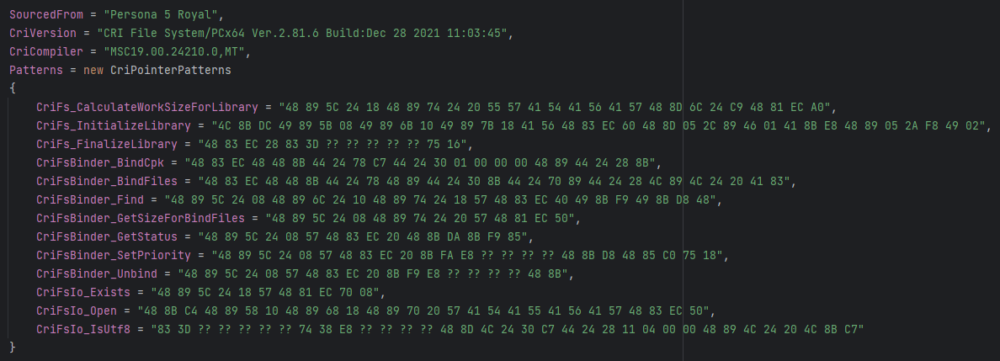
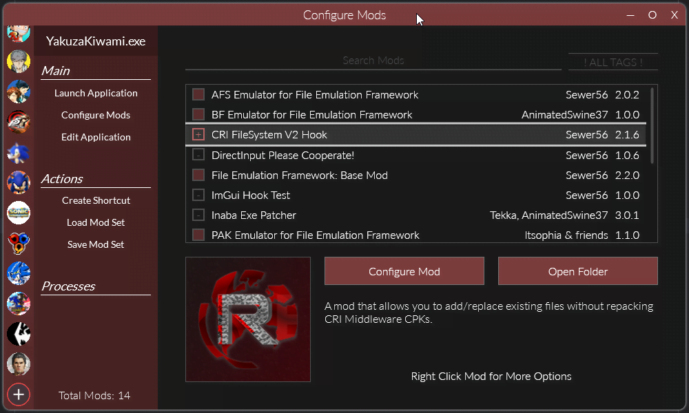
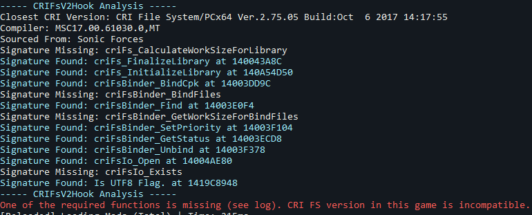
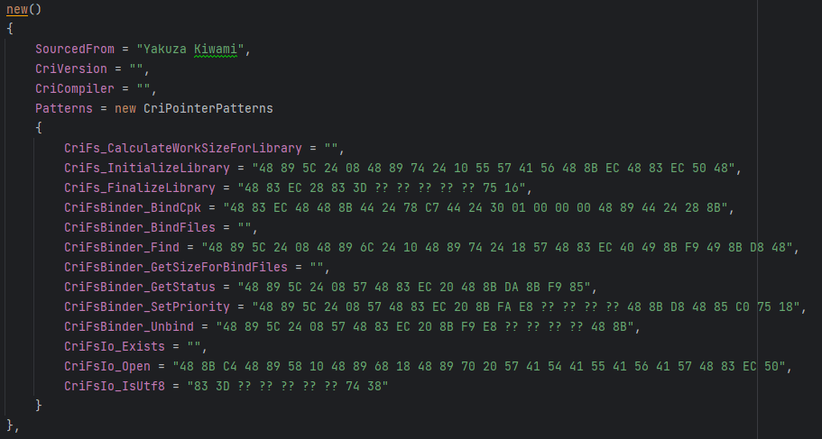
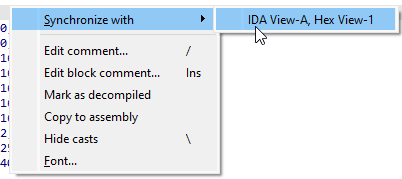

# Adding Game Support

!!! info "Provided for educational purposes. Legality of decompilation may vary worldwide."

!!! info "Shows you how to add support for additional games that are not already supported."

!!! note "Small amount of Programming experience required."

!!! note "For people unfamiliar with reverse engineering, this guide tries to be as beginner friendly as possible."

!!! tip "Once you're familiar with the process, adding support for a new game takes ~30 minutes."

## About

The implementation of CriFsV2Hook is specifically crafted to make use of as much 'public' APIs as possible;
and avoid internals.  

The existing logic should work with any game out of the box. However, it is possible that due to the library & compiler
combination used in a game, the mod might not be able to find the relevant functions to hook.  

!!! note "CriFsV2Hook relies on [Signature Scanning](https://reloaded-project.github.io/Reloaded-II/CheatSheet/SignatureScanning/) to find the relevant CRI functions."

## What you will be doing.

!!! info "We will be inserting function signatures to `CpkBinderPointers.cs`"



For this guide, I will demonstrate step by step process by adding support for a game and walking through what I did.

### Update the C# Project

To get started, add your game to Reloaded-II, and edit this mod's `ModConfig.json` file to auto enable support for this game:

```json
"SupportedAppId": [
    "p4g.exe",
    "p5r.exe",
    "p3p.exe",
    "p3p_sln_dt_m.exe",
    "sonic forces.exe",
    "opu3.exe",
    "slw.exe",
    "sonicgenerations.exe",
]
```

Add your game's Reloaded `AppId` to this list. This is usually the name of the `.exe` file in lowercase; otherwise
check `Apps` folder in Reloaded folder.

Once you are done, build the C# project.
In my case, I will add `yakuzakiwami.exe`.



Once built, the mod should show in your mods list for the given game.

### Test The Mod

!!! info "Test the mod to see how much works out of the box."

When you boot the game up with Reloaded, `CriFsV2Hook` will print out a log, showing the closest matching game.



If you are lucky, the mod might work out the box; if you're not; proceed and implement it with me.

### Copy the Closest Game's Config

Copy the config from the closest matching game, in this game I copied from *Sonic Forces*.



Blank out any signatures that were not found, as well as the compiler and CRI version.  
Verify whether the signatures are correct (using information later in this guide).  

## Setup Decompiler

!!! tip "IDA Pro is recommended, because of the [Lumen](https://abda.nl/lumen/) public Lumina server."

!!! tip "Lumen is a database of [function signatures](https://reloaded-project.github.io/Reloaded-II/CheatSheet/SignatureScanning/), all 3000+ CRI function signatures I made, including those used by the mod are uploaded there."

!!! tip "When using Lumen you should usually find a couple of hundred CRI functions automatically labeled for you out of the box for free."

- First please set up [Lumen](https://abda.nl/lumen/).  
- And install [SigMakerEx](https://github.com/kweatherman/sigmakerex) plugin.  
- Then, open your Disassembly in IDA.  

Press `Lumina -> Pull All Metadata`.  

!!! note "Games with a lot of code [especially Denuvo Titles] can take a while to pull from Lumen when you hit `Pull All Metadata`. It can even take 5 minutes, please be patient; the process is not 'stuck'."

If you don't have an existing disassembly, simply disassemble a new file with IDA and wait for analysis to finish.

### Denuvo DRM

!!! note "Denuvo titles can have some nastiness which is very modding unfriendly."

!!! tip "Consider refusing to buy any game which uses this kind of DRM and encourage your friends to do the same, too. (Also applies to: Microsoft Store DRM, Arxan, VMProtect, etc.)"

Unfortunately, as an anti-temper tech, Denuvo is by design engineered to make modding a painful experience. 

The Denuvo experience includes:  
- 30+ hours of waiting for analysis to complete. (Without Denuvo: 2-10 minutes)  
- Renaming EXE segments to try break decompilers [in more recent versions].  

In any case; here are some tips for dealing with Denuvo binaries.

#### Force Load All Segments

Modify the following setting (in `ida/cfg/pe.cfg`).
```
// Always load all sections of a PE file?
// If no, sections like .reloc and .rsrc are skipped
PE_LOAD_ALL_SECTIONS = YES
```

Without this setting, there's a good chance a chunk of your disassembly may appear 'wrecked' full of invalid references
to variables.

#### Skip Disassembling Obfuscated Game Code

!!! info "Around 70-90% of every Denuvo EXE is comprised of extreme obfuscation using virtual machines with randomised instruction sets."

!!! info "There's usually around 40-100 'hook-in' points which redirect game code to these virtual machines; obfuscating and holding the original game code hostage."

!!! info "That said, it is statistically very unlikely any CRI code will be held hostage, so it's wasteful to disassemble this."

Observe the 'segments' view in your disassembler:


The obfuscated, encrypted virtual machine stuff is usually the largest segment in the EXE, and towards the back of it.  

If you go to `View -> Open Subviews -> Segments`, you can delete this segment and analysis should complete in a more reasonable amount
of time that's not 30+ hours.  When deleting select both checkboxes (`Confirm Deletion` AND `Disable Addresses`).

!!! note "Denuvo is actually friendlier than DRMs of the past here; which would obfuscate code all over the place. Denuvo leaves most of the original code intact. 👍"

### Steam Embedded DRM

!!! note "If you run a game via Reloaded; it will log to console if Steam DRM is present."

If a game has Steam Embedded DRM (which encrypts game code); you will usually find your disassembler will report a 
low number of functions (< 200).  

In those cases, verify Steam DRM is present via booting in Reloaded, or via the `View -> Open Subviews -> Segments` window.  
If you see a section in there which is named `.bind`, Steam DRM is present.  

Remove this DRM with [Steamless](https://github.com/atom0s/Steamless), and throw the new EXE into your decompiler.

## Finding Functions

!!! info "Provides guidance on how to quickly find functions."

!!! tip "CRI has a lot of very helpful error logging; we will be taking advantage of this."

Now we will hunt for the missing functions; the general procedure is as follows:  
- Find the Function.  
- Create a function signature (`Edit -> Plugins -> SigMakerEx -> OK (Create Signature for Function)`)  
- Copy signature from `Output` window to source code.  

!!! note "In some rare cases, Lumen signatures might find the function, but our signatures didn't; try searching name in 'functions' window first."

!!! danger "Doublecheck (using the info below) that your existing signatures taken from other games are correct."

### Getting CRI Version

Open the Strings window (`View` -> `Open Subviews` -> `Strings`), filter for string `CRI File System/` and doubleclick the result.


Copy the CRI version and compiler info into the source code:


### CriFs_InitializeLibrary

!!! info "This acts as a general tutorial of what to do later; after this, you're left on your own."

Select the variable that contains the version string, right click it and hit `Jump to xref to Operand` (hotkey: `x`).  


Press `F5` ('Generate Pseudocode'), and drag out the tab with the C code; docking it to the right, your window should now look like this:  


Now sync the pseudocode window with main view by right clicking:



This function you see is `criFs_InitializeLibrary`, to rename it, click on function name, and press `N`, then rename it to `criFs_InitializeLibrary`.  

Then, to get the signature, move the cursor to the start of the function and open SigMakerEx `(Edit -> Plugins -> SigMakerEx)`.

Create a signature for a function, and copy it from the Output Window in IDA.


And into the source code:

```csharp
CriFs_InitializeLibrary = "48 89 5C 24 18 48 89 7C 24 20 55 41",
```

You're on your own from now 😉.

### CriFs_CalculateWorkSizeForLibrary

!!! info "This function is called to get amount of memory to allocate before it is passed to `criFs_InitializeLibrary`."

To find this function, search for error string `E2009070701` and find the method that uses it.  
That method is `criFs_CalculateWorkSizeForLibrary`.  

### CriFs_FinalizeLibrary

Search for method which uses error string `E2008072816`.

### CriFsBinder_BindCpk

Search for method which uses error string `E2008071620`. This method is `criFsBinder_BindCpkSub`.  
The method which calls this method is `criFsBinder_BindCpk`.  

### CriFsBinder_BindFiles

Search for method which uses error string `E2008071630`. This is `criFsBinder_bindFilesSub`.  
This method is called by `criFsBinder_BindFile` and `criFsBinder_BindFiles`.  

The method which passes a constant `-1` to `criFsBinder_bindFilesSub` is `criFsBinder_BindFiles`,
the other method that passes constant `1` is `criFsBinder_BindFile`.

!!! warning "`criFsBinder_BindFiles` may not exist in some games. If that's the case happens, provide the signature for `criFsBinder_BindFile` instead. CriFsV2Hook will try to patch that function to allow binding of multiple files."

!!! tip "That patching happens in `CpkBinder.cs`"

### CriFsBinder_Find

Search for method which uses error string `W2008121610`. This is `crifsbinder_checkBoss`.  
Then check out the 4-8 methods which call said method.  

One of them will be find, which looks like this:  
```c++
// Usually looks like this 
__int64 __fastcall criFsBinder_Find(int a1, __int64 a2, void **a3, _DWORD *a4)
{
  __int64 result; // rax

  if ( a4 )
    *a4 = 0;
  if ( a3 )
    memset(a3, 0, 0x30ui64);
  if ( (unsigned int)crifsbinder_checkBoss() )
    return 0xFFFFFFFFi64;
  result = sub_1400411F4(a1, 0, 0i64, (__int64)a4);
  if ( a3 )
  {
    if ( *a3 == &unk_1419C6A68 )
      *a3 = 0i64;
  }
  return result;
}
```

In older versions of CRI, it might look more like this:

```c++
int __cdecl criFsBinder_Find(int a1, __int16 a2, void *a3, _DWORD *a4)
{
  if ( a4 )
    *a4 = 0;
  if ( a3 )
    sub_4490D0(a3);
  if ( sub_448F3B() )
    return -1;
  else
    return sub_44A771(a2, (int)a3, 0, 0);
}
```

!!! warning "DO NOT confuse this with FindById"

```c++
__int64 __fastcall criFsBinder_FindById(int a1, int a2, void *a3, _DWORD *a4)
{
  int v5; // ebx

  v5 = (int)a3;
  if ( a4 )
    *a4 = 0;
  if ( a2 < 0 )
  {
    criErr_NotifyGeneric(0i64, "E2014012701", 4294967294i64);
    return 0xFFFFFFFFi64;
  }
  if ( a3 )
    memset(a3, 0, 0x30ui64);
  if ( (unsigned int)crifsbinder_checkBoss() )
    return 0xFFFFFFFFi64;
  return sub_140040E44(a1, a2, v5, 0, 0i64, (__int64)a4, 0i64);
}
```

If you see `E2014012701`, you found `FindById`. 
Out of all the methods that call `crifsbinder_checkBoss`, `criFsBinder_Find` should be the only one that does not call
`criErr_NotifyGeneric`.  

### CriFsBinder_GetWorkSizeForBindFiles

Search for method which uses error string `E2008082901`, this is `criFsBinder_GetWorkSizeForBindFiles`.

### CriFsBinder_GetStatus

Search for method which uses error string `E2012082901`, this is `criFsBinder_GetStatus`.

!!! note "This error was added in 2012."

For games older than 2012, finding this function can be a bit harder; since this is called often from various contexts
and has no strings attached.

The code you want looks something like this:

```c++
int __cdecl criFsBinder_GetStatus(int a1, _DWORD *a2)
{
  int v3; // eax

  if ( sub_7D17D0() )
  {
    sub_7D32B2(a1);
    if ( a2 )
    {
      v3 = sub_7D17D0();
      if ( v3 )
        *a2 = *(_DWORD *)(v3 + 32);
      else
        *a2 = 4;
      return 0;
    }
    else
    {
      return -2;
    }
  }
  else
  {
    if ( a2 )
      *a2 = 2 * (a1 == 0) + 4;
    return -2;
  }
}
```

The interesting/'dead giveaway part' is the following:

```c++
v3 = sub_7D17D0();
if ( v3 )
  *a2 = *(_DWORD *)(v3 + 32);
else
  *a2 = 4;
return 0;
```

A semi-reliable way to find this function is the following:  
- Find function with string `E2008071610`.  This is `criFsBinder_Destroy`.  
- Sort the `functions` window by address.  
- Check functions 1 by 1, by address, ascending.  

You should find it within the next ~40 functions. Usually within 10.

The reason we choose `criFsBinder_Destroy` as a reference specifically is because the CRI source must have been reorganised, but
in every known CRI version, `criFsBinder_Destroy` and `criFsBinder_GetStatus` are in the same `.obj` file, and thus are in proximity
of each other.

### CriFsBinder_SetPriority

!!! warning "This method is not present in some games, due to dead code elimination."

!!! warning "If it does not exist, leave the signature empty. Chances are CriFsV2Hook will still work."

Search for method which uses error string `E2008072390`, this is `criFsBinder_SetPriority`.

### CriFsBinder_Unbind

Search for method which uses error string `E2008122691`, this is `criFsBinder_Unbind`.

### CriFsIo_Open (Windows)

Search for method which uses error string `W2007060101`, this is `criFsIoWin_Open`.

### CriFsIo_Exists (Windows)

Search for method which uses error string 
- `E2008081901` (pre 2015 titles)
OR
- `E2015091137` (post 2015 titles)

This is `criFsIoWin_Exists`.

### CriFsIo_IsUtf8 (Windows)

This is a signature which points to an `if` statement (`cmp` instruction) inside `CriFsIo_Exists`. Specifically this code.

```c++
if (isUtf8)
{
  v4 = strlen(lpMultiByteStr);
  MultiByteToWideChar(0xFDE9u, 0, lpMultiByteStr, v4 + 1, WideCharStr, 521);
  FileAttributesW = GetFileAttributesW(WideCharStr);
}
else
{
  FileAttributesW = GetFileAttributesA(lpMultiByteStr);
}
```

We extract the int32 boolean from here.

You are done. Go test :p.

## When You're Done

For debugging purposes, feel free to use the toggles inside CriFsV2Hook's mod configuration.

Be a good citizen and upload your renamed CRI functions to Lumen, (`Lumina` -> `Push All Metadata`).  

!!! warning "Lumen signatures cannot be renamed once uploaded, please only upload after you get all of your function names correct."